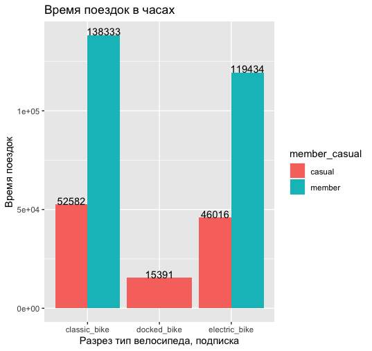
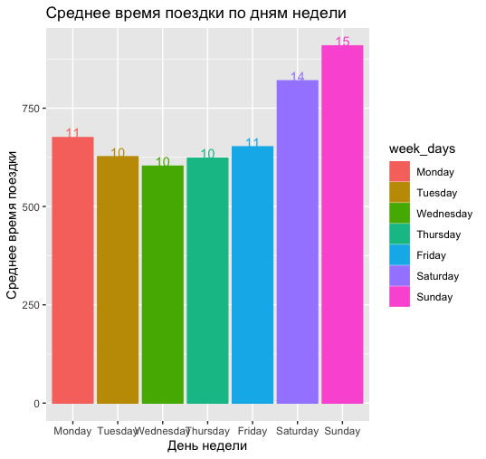
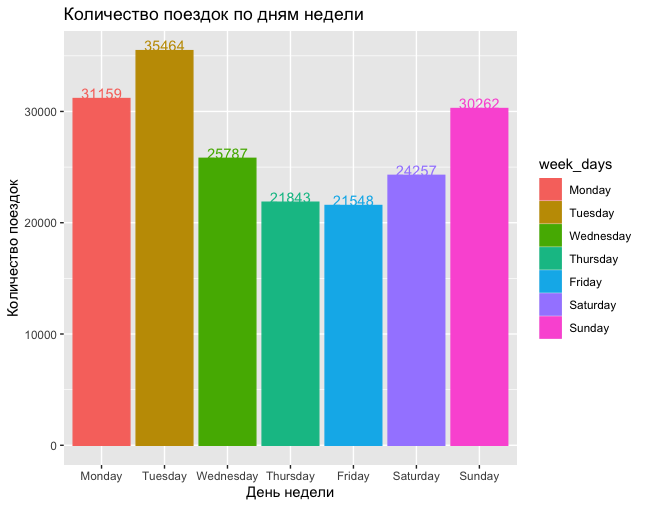

# Cyclistic: A bike share program
Данный проект является частью профессиональной сертификации 'Google Data Analytics' 

Cyclistic: программа проката велосипедов, включающая более 5800 велосипедов и 600 док-станций для зарядки электро-велосипедов.  

Также предлагая лежачие велосипеды, ручные трехколесные велосипеды и грузовые велосипеды, что делает прокат велосипедов более инклюзивным для людей с ограниченными возможностями.  
Инвалиды и водители, которые не могут использовать стандартный двухколесный велосипед.  
Большинство  выбирают традиционные велосипеды, но 8%  используют вспомогательные опции.  
Велосипедисты чаще ездят на велосипеде для отдыха, но около 30% используют их для езды на работу каждый день.

Проект нацелен на улучшение коммуникации с потребителями, лучшему пониманию из потребностей, выстраиванию маркетинговой политики для привлечения новых клиентов. Так же выжным параметром является сохранение и увеличение райдеров с подпиской.

Проект полностью выполнен с использованием R-studio, dерсия 2023.03.0+386.

Установка необходимых пакетов для раборы:
```
install.packages("tidyverse", "ggplot2", "rstudioapi", "ggmap")
library(tidyverse, ggplot2, rstudioapi, ggmap)  
```
Данные для анализа доспутны по [ссылке.](https://divvy-tripdata.s3.amazonaws.com/index.html)  
Загрузка данных в R с использование функуии read_csv пакета readr включенного в tidyverse.  
Важным является указание форматов для колонок с датами еще на этапе формирования дата-сета, что бы не иметь с этип проблем в будущем.
```
X202302_divvy_tripdata <- read_csv("Desktop/Rproject/202302-divvy-tripdata.csv", 
                                   col_types = cols(started_at = col_datetime(format = "%Y-%m-%d %H:%M:%S"), 
                                                    ended_at = col_datetime(format = "%Y-%m-%d %H:%M:%S")))
```
Создав дата-сет трансформирую его, дабавляя две колонки с помощью функции mutate.  
ride_length - высчитываю время поезки в секундах  
week_days - нахожу день недели начала поездки  
```
df <- X202302_divvy_tripdata
mutate (df, ride_length =  df$ended_at - df$started_at)
mutate (df, week_days = format(as.Date(df$started_at),"%A"))
```
С помошью функии filter очищаю дата-сет от записей с временемм поедки меньше минуты и от записей где не указаны координаты конца поездки.
```
df<- filter (df, ride_length > 0,!is.na(end_lat))
```
Получив очищенные данные создаю 2 агрегированные таблицы.  
В разрезе типа велосипеда и велосипедиства (подписчик / случайный райдер) расчитываю время всех поедок в секундах, время средней поезки и общее количество поездок. Аналогичные данные высчитываю в разрезе дней недели. 

```
agg_df <- df %>% 
  group_by(rideable_type, member_casual) %>% 
  summarise (sum = sum(ride_length), 
             avg = mean(ride_length),
             cnt = n()  )
```
| rideable_type | member_casual | sum           | avg            | cnt   |
|---------------|---------------|---------------|----------------|-------|
| classic_bike  | casual        | 18929502 secs | 1222.5201 secs | 15484 |
| classic_bike  | member        | 49799914 secs | 669.9931 secs  | 74329 |
| docked_bike   | casual        | 5540804 secs  | 2575.9200 secs | 2151  |
| electric_bike | casual        | 16565867 secs | 655.1658 secs  | 25285 |
| electric_bike | member        | 42996113 secs | 588.4156 secs  | 73071 |
```
agg_df_week <- df %>% 
  group_by(week_days) %>% 
  summarise (sum = sum(ride_length), 
             avg = mean(ride_length),
             cnt = n()  ) %>% 
  arrange(ordered(week_days, levels = c("Monday", "Tuesday", "Wednesday", "Thursday", "Friday","Saturday","Sunday")))
```
| week_days | sum           | avg           | cnt   |
|-----------|---------------|---------------|-------|
| Monday    | 21041495 secs | 675.2943 secs | 31159 |
| Tuesday   | 22224027 secs | 626.6644 secs | 35464 |
| Wednesday | 15538631 secs | 602.5761 secs | 25787 |
| Thursday  | 13602135 secs | 622.7228 secs | 21843 |
| Friday    | 14047113 secs | 651.8987 secs | 21548 |
| Saturday  | 19885015 secs | 819.7640 secs | 24257 |
| Sunday    | 27493784 secs | 908.5250 secs | 30262 |

Данные получены. Приступаю к построению графиков основынных на данных с помощью пакета ggplot2.  

Построил графики отражающие среднее время одной поездки в минутах и время прокатаю
```
ggplot(data = agg_df, aes(x = rideable_type, y = round(avg/60, digit = 0), 
                          group = member_casual)) +
  geom_col(aes(fill = member_casual), 
           position = "dodge") +
  geom_text(aes(label = round(avg/60, digit = 0), avg = avg + 0.05), 
            position = position_dodge(0.9), vjust = 0)+
  labs(title = "Среднее время одной поездки в минутах",
       x = "Разрез тип велосипеда, подписка",
       y = "Время поездок")
```
<picture>
  <source media="(prefers-color-scheme: dark)" srcset="Rplot 1.png">
  <source media="(prefers-color-scheme: light)" srcset="Rplot 1.png">
  
</picture>  

Без учета docked_bike время среднее время одной поездки сопостовимо для электрических и классическиз велосипедов (10-11 минут).  
Явно выделяются поездки на классических велосипедах случайными пользователями (20 минут).
```
ggplot(data = agg_df,   aes(x = rideable_type, y = round(sum/360, digit = 0), 
                            group = member_casual)) +                           
  geom_col(aes(fill = member_casual), 
           position = "dodge") +                                                
  geom_text(aes(label = round(sum/360, digit = 0), sum = sum + 0.05), 
            position = position_dodge(0.9), vjust = 0)+
  labs(title = "Время поездок в часах",
       x = "Разрез тип велосипеда, подписка",
       y = "Время поездок")
```
<picture>
  <source media="(prefers-color-scheme: dark)" srcset="Rplot2.png">
  <source media="(prefers-color-scheme: light)" srcset="Rplot2.png">
  
</picture> 

Суммарный график дает понять что основные пользователи проката это велосипедисты, у которых оформлена подписка, небольшой приоритет отдается классичксим велосипедам. Доля случайных пользователей 2.5 - 3 раза ниже.

Построил графики отражающие нагрузку по дням недели.

```
agg_df_week$week_days <- factor(agg_df_week$week_days, levels = c("Monday", "Tuesday", "Wednesday", "Thursday", "Friday","Saturday","Sunday"))
ggplot( data = agg_df_week, aes(x = week_days, y = avg, color = week_days, fill = week_days))+
  geom_col()+
  geom_text(aes(label = round(avg/60, digit = 0), avg = avg + 0.05), 
            position = position_dodge(0.9), vjust = 0)+
  labs(title = "Среднее время поездки по дням недели",
       x = "День недели",
       y = "Среднее время поездки")
```
<picture>
  <source media="(prefers-color-scheme: dark)" srcset="Rplot3.png">
  <source media="(prefers-color-scheme: light)" srcset="Rplot3.png">
  
</picture> 

Яыными лиделами являются выходные дни. Если рассматривать графики за короткие промежутки времени данным могут отличатся. Выходные дни с плохой погодой не покажут сопостовимые данные, так и будние дни выпадающие на праздники могут сильно выделятся от статистики за большой период.

```
agg_df_week$week_days <- factor(agg_df_week$week_days, levels = c("Monday", "Tuesday", "Wednesday", "Thursday", "Friday","Saturday","Sunday"))
ggplot( data = agg_df_week, aes(x = week_days, y = cnt, color = week_days, fill = week_days))+
  geom_col()+
  geom_text(aes(label = cnt, avg = avg + 0.05), 
            position = position_dodge(0.9), vjust = 0)+
  labs(title = "Количество поездок по дням недели",
       x = "День недели",
       y = "Количество поездок")
```
<picture>
  <source media="(prefers-color-scheme: dark)" srcset="Rplot4.png">
  <source media="(prefers-color-scheme: light)" srcset="Rplot4.png">
  
</picture> 

Особенно интересным выглядит график распределения количетсова поездок по дням недели, где явно лидирует начало недели. С большой долей вероятности это пользователи, которые хотят решить рабочие вопросы в начале недели, не тратя время в пробках.

Построим график рассеивания. К сожалению не смог полноценно воспользоваться библиотекой ggmap. Точки начала поездок перенс на google maps с помощью CorelDrow с привязкой к двум точкам.

```
ggplot(data = df)+
  geom_point(data = df, mapping = aes (y = start_lat, x = start_lng), 
             size = 0.4, 
             shape = 23, 
             fill = "green")+
  geom_point(data = df, mapping = aes (y = end_lat, x = end_lng), 
             size = 0.4, 
             shape = 23, 
             fill = "red")+
  labs(title = "Координаты начала и конца поездок",
       x = "Долгота",
       y = "Широта")
```
<picture>
  <source media="(prefers-color-scheme: dark)" srcset="Rplot5.png">
  <source media="(prefers-color-scheme: light)" srcset="Rplot5.png">
  
</picture> 

Из-за высокой плотности в середине графика не совсем понятнен спрос в самой густой точке.
Строим тепловую карту и переносим на google maps.

```
ggplot(data = df)+
  stat_density_2d(data = df, mapping = aes (y = start_lat, x = start_lng, fill = ..level..),
                  size = 1,
                  geom = "polygon",
                  color = "blue",
                  alpha = 0.07)+
  stat_density_2d(data = df, mapping = aes (y = end_lat, x = end_lng, fill = ..level..),
                  size = 1,
                  geom = "polygon",
                  color = "red",
                  alpha = 0.07)+
  labs(title = "Тепловая карта",
       x = "Долгота",
       y = "Широта")
```
<picture>
  <source media="(prefers-color-scheme: dark)" srcset="Rplot6.png">
  <source media="(prefers-color-scheme: light)" srcset="Rplot6.png">
  
</picture> 

Основные поездки начинаются в центре города. Особенно выделяется Чикагский институт искусств.

Наложение графиков так же возможно через библиотеку ggmaps, как еще один слой к ggplot.

```
register_google(key = "AI-------------------------------0")
centr_lgn <- mean(df$start_lng)
centr_lat <- mean(df$start_lat)
ggmap(get_googlemap(center = c(centr_lgn,centr_lat)
                    , zoom = 10
                    , maptype = 'terrain'
                    , color = 'color'
))
```
Полученные данные позволяют получить портрет о пользователе шеринга велосипедов.
Тепловые карты дают понятие о самых востребованныз локациях для шеринга, среднем времени поезки, предпочтениях для проката.
Полученные графики дают больше информации для выстраивания маркетинговой коммуникации с потребителями.

